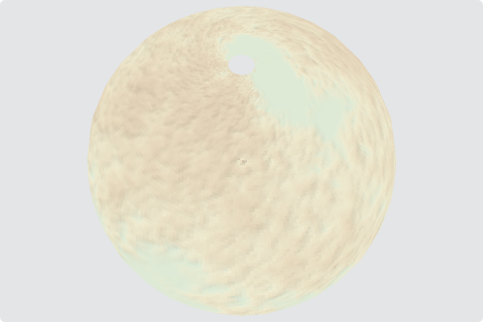
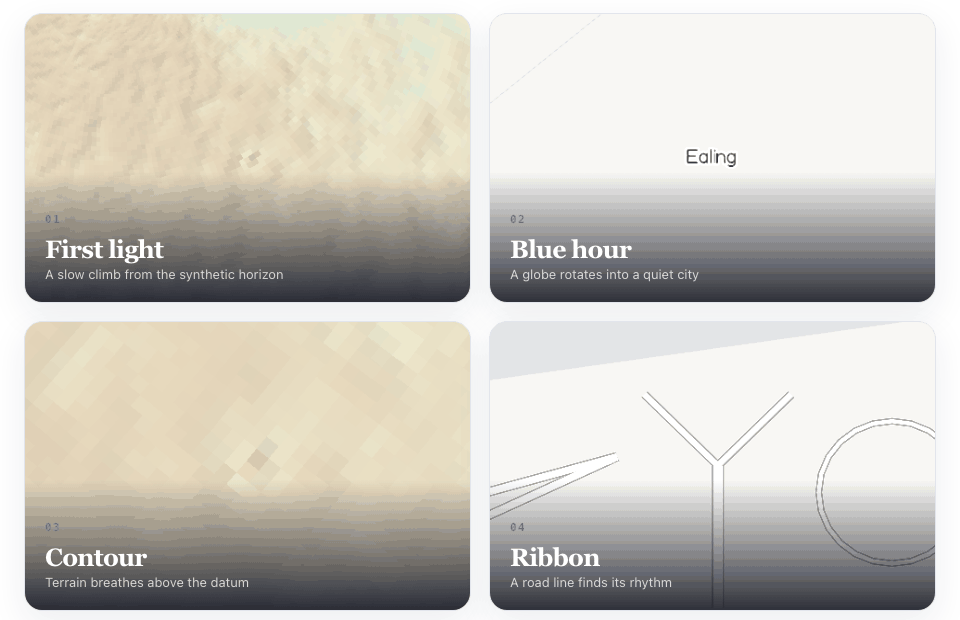

# 3D Maps SDK v2

> A deterministic Rust/Wasm 3D map renderer with a browser laboratory.

**Status:** `v0.1.0-alpha` · deterministic fixtures and local open-data pipeline · MIT

This repository is an SDK/demo alpha, not a production map of London or the
world. It focuses on a small, inspectable rendering core: versioned binary
tiles, deterministic fixture generation, WebGL2 rendering, interaction, labels,
terrain, and globe relief.





## What is included

- Rust crates for units, camera math, MT2 tile parsing, style, rendering, text,
  fixtures, and a WebGL2/Wasm binding.
- A browser lab with isolated visual cards for zoom bands, road joins and
  casing, input, point-label collision, density, terrain, and globe relief.
- An **MT2 v4** tile format with v1/v2/v3 readers, deterministic synthetic fixtures, Rust unit
  tests, Playwright visual tests, and an executable p95 frame budget of ≤10 ms.

## What is not included

No published real-world London/world package, `roads-real`, routing, geocoding,
search, production data hosting, mobile host, road-following line labels, POI
icon labels, or full Unicode shaping is included. Named roads render as
upright midpoint labels; curved, repeated, and language-shaped road text remain
future work. Real-world data is a beta goal;
see [the beta plan](libraries/maps-v2/docs/real-data-beta-plan.md) and the
[production roadmap](libraries/maps-v2/docs/production-roadmap.md).

The first ingest foundation can verify, scan, and build z16 vector MT2 tiles
from the pinned Greater London OSM extract without committing it. It includes
roads, building footprints, water, parks, simple outer/inner multipolygon rings, named
places and amenity points. Road bridge/tunnel flags are preserved for the
renderer, and pinned Copernicus height rasters attach to
every generated London z16 tile. It clips cross-tile geometry deterministically,
but does not yet provide browser-ready real-data coverage. See the [pipeline
guide](pipelines/maps-v2-ingest/README.md).

The package manifest is the browser-host contract: it carries an MT2 format
version, sorted relative tile paths, a default view, source attribution, and
SHA-256 digests for every tile. The browser loader verifies those digests before
passing downloaded bytes to the renderer. It rejects manifests with more than
50,000 tiles and individual tile responses larger than 4 MiB before decoding.
After a camera move, it releases tiles outside the visible viewport plus the
renderer’s one-tile keep margin, so package CPU memory does not grow without
bound during exploration. The lab's **Пакет: загрузка по спросу** study exercises demand loading against
the same contract using synthetic tiles and accepts a host-selected manifest
URL for local real-data acceptance. Real derived packages remain external
release assets until their source terms and attribution are approved.

## Try the lab

Requirements: stable Rust, the `wasm32-unknown-unknown` target, `wasm-pack`,
Node.js 22.13+, and Chromium for end-to-end tests.

```sh
git clone https://github.com/bmsdave/3d-map.git
cd 3d-map
rustup target add wasm32-unknown-unknown
cargo install wasm-pack
cd applications/maps-v2-lab
npm ci
npx playwright install chromium
npm run dev
```

Open `http://localhost:5178`. Direct routes make each renderer concern easy to
inspect, for example `/#/showcase`, `/#/card/roads-micro`, and
`/#/card/globe-relief`. The showcase contains twenty animated, live SDK studies.

To inspect a locally hosted London or regional package, open
`/#/card/package-loader`, replace **Manifest URL** with its `manifest.json`
URL, and choose **Загрузить пакет**. The package host must permit browser CORS
requests; the loader verifies every requested tile against the manifest’s
SHA-256 digest before rendering it.

## 20 animated studies

Launch the full gallery at `/#/showcase`. Every study is a live WebGL2 canvas
driven by the SDK, with a shared pause/play control — not a video, GIF, or
mockup. The scenes use only the committed deterministic fixture packages.

| # | Study | Focus |
| --- | --- | --- |
| 01 | First light | Globe-scale synthetic relief |
| 02 | Blue hour | Globe-to-city transition |
| 03 | Contour | Terrain perspective |
| 04 | Ribbon | Animated road line |
| 05 | Long shadow | Hillshade and relief |
| 06 | Crossfade | Flat/globe blend |
| 07 | Junction | Road join geometry |
| 08 | Atlas | Collision-managed labels |
| 09 | Orbit | Low-altitude globe arc |
| 10 | Green room | Park and land composition |
| 11 | Switchback | Sharp road turns |
| 12 | Highlands | Relief exaggeration |
| 13 | Northbound | Camera movement |
| 14 | Roundabout | Continuous circular road |
| 15 | Far side | Globe curvature |
| 16 | Density | Label placement under load |
| 17 | Overpass | Bridges and tunnels |
| 18 | Rise | Globe-only terrain displacement |
| 19 | City pulse | Continuous zoom bands |
| 20 | Afterglow | Terrain exit pass |

The older direct-link cards remain available for technical inspection and
regression testing. The showcase is the polished presentation surface; the
cards are the engineering workbench behind it.

## Verify a clean checkout

```sh
cd libraries/maps-v2
cargo test --workspace
cargo clippy -p maps2-units --all-targets -- -D warnings
cd ../../applications/maps-v2-lab
npm run build
npm run test:e2e
```

The lab regenerates its synthetic fixture output locally. It needs no
proprietary data, pipeline cache, or external map package.

## Initial local-SDK scope

This first open-source version is for local development. It includes the SDK,
browser lab, deterministic fixtures, and a reproducible local pipeline for
openly licensed OSM and Copernicus inputs. The application code is MIT.

It deliberately excludes package hosting/distribution, package signing,
rollback/on-call processes, and production service support. Those are later
owner-led release decisions, not requirements for using or contributing to the
SDK locally.

## SDK shape

```rust
use maps2_units::{Lonlat, Zoom};

let centre = Lonlat { lon: -0.3049, lat: 51.5149 };
let zoom = Zoom::new(14.5);
```

The browser host creates a `maps2-web` map for a canvas, loads MT2 tile bytes
once, sends camera/style changes, and calls `render()`. Persistent tile buckets
stay on the GPU between frames. `debug()`, label diagnostics, pixel samples, and
frame measurements are host-requested diagnostics rather than hidden per-frame
work. The lab's [`sdk.ts`](applications/maps-v2-lab/src/sdk.ts) is the complete
working Wasm integration example.

## Architecture

| Area | Responsibility |
| --- | --- |
| `maps2-units`, `maps2-camera` | Coordinate units, camera state, flat/globe projection |
| `maps2-tile` | MT2 v4 writing and validated v1/v2/v3 reading |
| `maps2-style`, `maps2-render` | Class visibility, persistent mesh buckets, road and terrain draws |
| `maps2-text` | Deterministic SDF atlas and collision-managed point labels |
| `maps2-fixtures` | Reproducible synthetic Ealing, road-pathology, and ridge packages |
| `maps2-web` | WebGL2/Wasm browser boundary |
| `maps-v2-lab` | Interactive demo, visual goldens, and browser contracts |

## MT2 tile format

MT2 uses a fixed header, an O(1) section table, integer tile coordinates,
delta/varint vector geometry, building base/top/roof data, and optional height
rasters. Version 4 is the current write format and readers accept versions
1–3: a layout change requires a version bump, fixture migration, and an
intentional golden update. Read the full [MT2 specification](libraries/maps-v2/docs/tile-format.md).

## Supported environment

CI targets Linux, Rust stable, Node 22, Chromium, Wasm, and WebGL2. The lab is
intended for current desktop WebGL2 browsers, but broad browser compatibility is
not yet promised. This alpha is deliberately browser-first; iOS, Android, SSR,
and headless renderer support remain future work.

## Contributing and security

Read [CONTRIBUTING.md](CONTRIBUTING.md) before proposing behavioral or format
changes. Public security reports are not appropriate; see [SECURITY.md](SECURITY.md).
The contribution space follows [CODE_OF_CONDUCT.md](CODE_OF_CONDUCT.md).

## License

Licensed under [MIT](LICENSE). Copyright 2026 Vadim.
